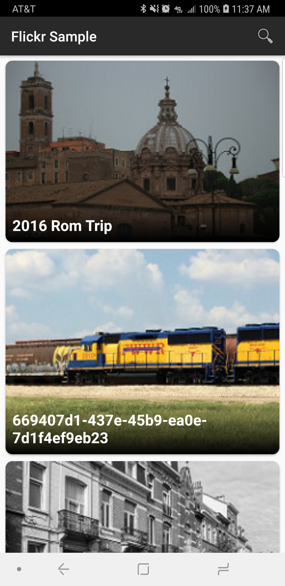
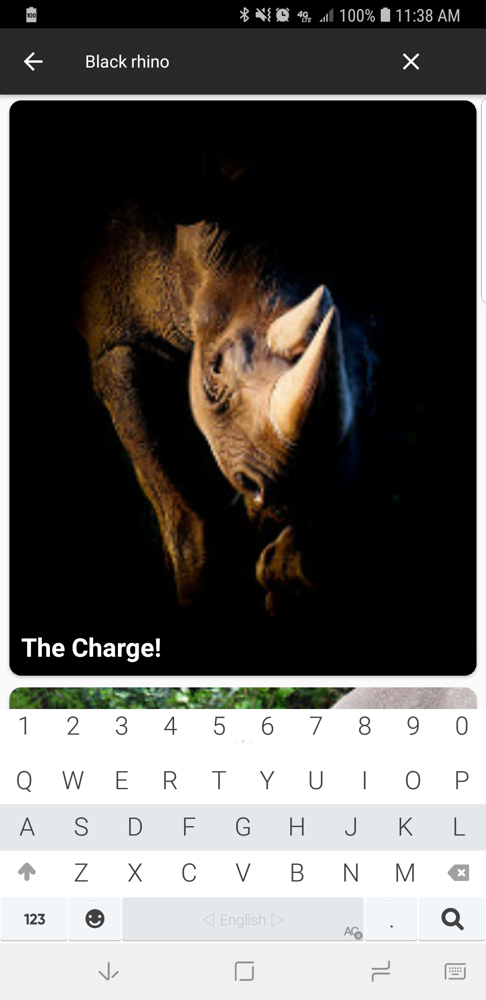
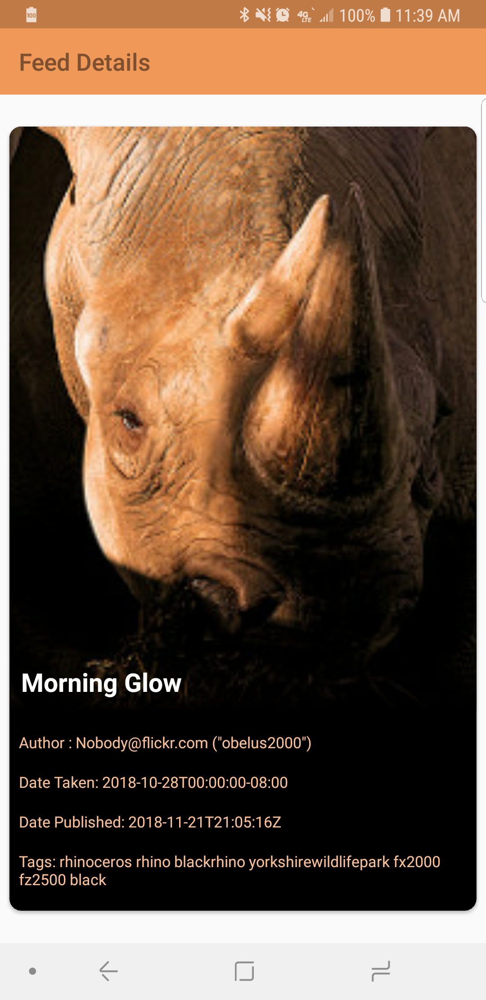

# Flickr Sample
This app allows users to browse images from Flickr as well as search images with specific tags and view the individual details of each image feed.

## Installation:
You should be able to clone the project and run it on Android Studio.

## Libraries:
* Android Support Library.
* Android Palette API
* Android Architecture Components: LiveData & ViewModel.
* Glide.
* Retrofit.

## A few enhancements to keep in mind:
* Continue adding details on details screen.
* Add unit testing.
* Add an empty view in cases: no query requested by user OR no search results for user's requested query.
* Add a loading dialog/view when a query is being performed.

## Known Bugs:

## Screenshots:
* Main view:

* Seacrh view:

* Details view:

